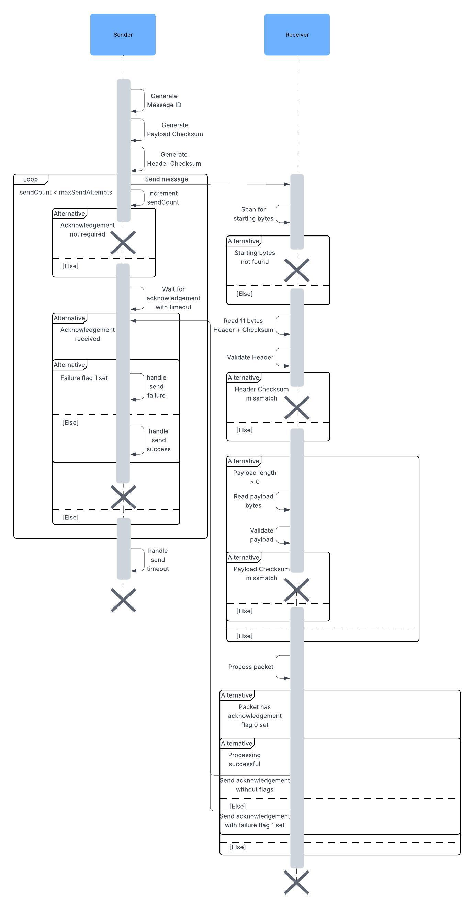

# Packeteer
This is a lightweight and resource efficient client for sending and receiving data in form of packets. It includes the following features
* data validation through checksums
* packet acknowledgement and resend
* up to 255 different packet implementations
* free choice of communication channel (bluetooth, Wi-Fi, cellular, ...)
* Protocol and packet versioning

# Transmission
Data is transferred in form of packets. A packet is defined by its type, version and flags. This tells the recipient how to 
handle it when received. The packet and its payload are accompanied by additional data which is as whole is considered a message.

* Starting bytes are the first 16 bit and serve as a marker at the start of each message. This allows the client to detect the beginning of a message and is 
especially useful in cases like data corruption or transfer interrupts. They are always `0xF` followed by `0xA`
* Protocol version is an 8 bit version code you may use as an overall version for your transmissions. This value has no influence on the behaviour 
of this library
* Message ID is an 8 bit identifier that is generated by the sender in sequence and will wrap-around once the end of the ID space has been reached. Note that 
both transmission partners generate their IDs independent of each other, meaning received and sent messages may have the same ID
* Packet type is the 8 bit identifier for the type of the packet. Type `0` is reserved for acknowledgements. See [Acknowledgement](#acknowledgement)
* Packet version is the 8 bit version of the packet
* Packet flags is an 8 bit flag field. Bit `0` is reserved for acknowledgements. See [Acknowledgement](#acknowledgement)
* Payload length is the 16-bit unsigned length of the payload. 0 if no payload is sent
* Payload CRC16 is the 16-bit CRC16 checksum of the payload. 0 if no payload is sent. See [Checksums](#checksums)
* Header CRC16 is the 16-bit CRC16 checksum of the entire header. See [Checksums](#checksums)
* Payload is the payload data of the packet. May be omitted if a packet has no payload

The transmission flow is described in the following diagram

Click to open diagram

## Acknowledgement
Packets that require acknowledgement by the receiver must have bit 0 in their flags set. Only then will the receiver send back 
an acknowledgement packet with type 0, version 1 and the message ID of the received packet after processing it is finished.  
If processing failed, additionally failure flag 1 is set.  

If the sender is expecting an acknowledgement but doesn't receive it, packets will be resent until either an acknowledgement is 
received or the maximum count of sending attempts has been reached.

When using this implementation you only need to make sure that packets have the acknowledgement flag 0 set if acknowledgement is desired. 
The remaining handling and states are all managed by the `Client` implementation

## Checksums
For header and payload a 16-bit CRC-16/IBM Checksum is generated. It uses following parameters
* Initial value: `0x0`
* Polynomial: `0xA001`
* Processing order: LSB to MSB
* Input reflection: Yes
* Output reflection: No
* Final XOR: `0x0000`

# Usage
To use `Client` you need to provide an implementation of
* `NetworkAdapter`: Provides the RW interface to the transmission partner. This allows communication through any channel of your choice
* `PacketFactory`: Creates your `IncomingPacket` subtypes when packets are received. This allows for custom packet implementations

Provide a protocol version, count of max send attempts, your NetworkAdapter and PacketFactory when initializing it.
~~~
new Client(protocolVersion, maxSendAttempts, yourAdapter, yourPacketFactory);
~~~

To send a packet, first initialize it with type, version and flags. Then send it, optionally with a payload.

~~~
byte flags = (byte) BitUtil.createFlags(...);// set acknowledgement flag 0 if your packet should be acknowledged
Packet packet = new Packet(type, version, flags);
byte[] optionalPayload = {...};
client.send(packet, optionalPayload);
~~~

To receive packets, implement all supported types by extending `IncomingPacket` and add them to your PacketFactory

~~~
class YourPacket extends IncomingPacket{
 
    public YourPacket(byte type, byte version, byte flags) {
        super(type, version, flags);
    }

    @Override
    public void process(byte @Nullable ... payload) throws ProcessingException {
        System.out.println("Processing your packet");
    }
}

class YourFactory implements PacketFactory {
    
    @Override
    public @NotNull IncomingPacket create(byte protocolVersion, byte type, byte version, byte flags) throws ProcessingException {
        return new YourPacket(type, version, flags);
    }
    
}
~~~

Then call `receive()` on your client whenever you wan't to process the next incoming packet (for instance when your adapter's input 
has new bytes available). The factory will be called to create the corresponding packet and then the packet's process method is 
called to process it.